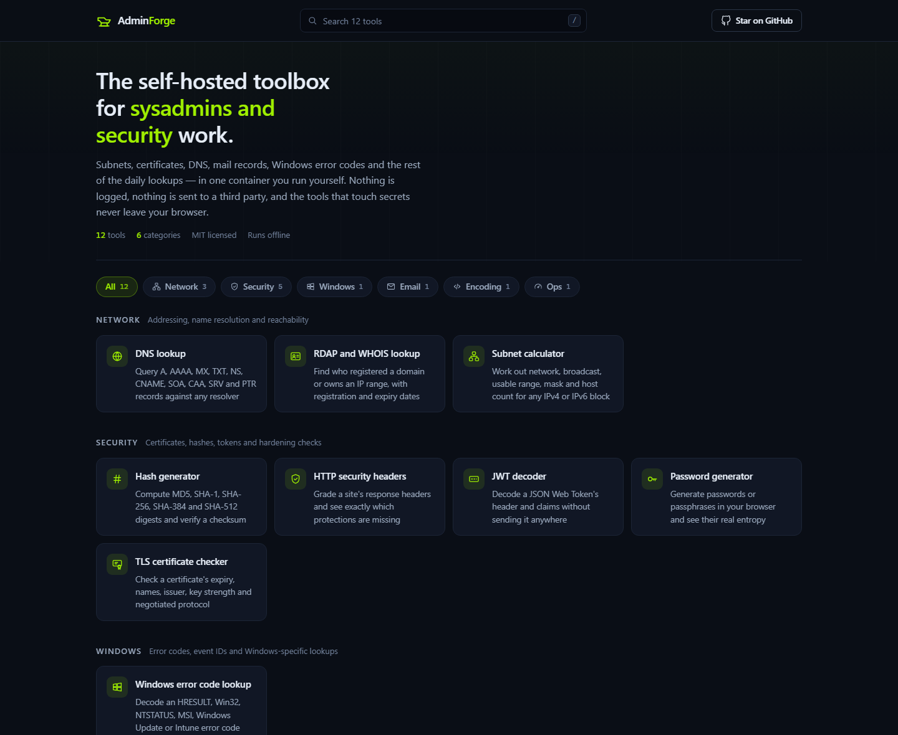
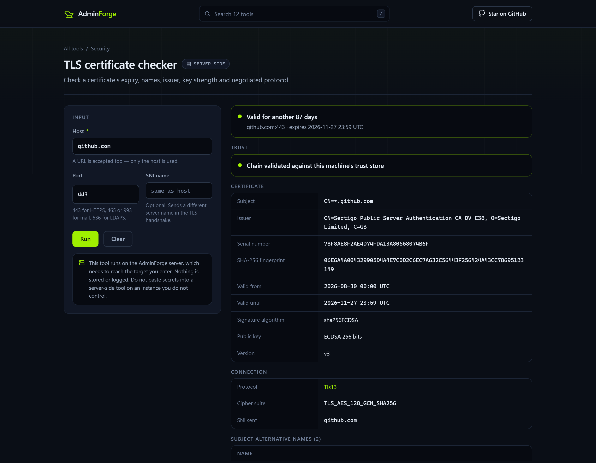
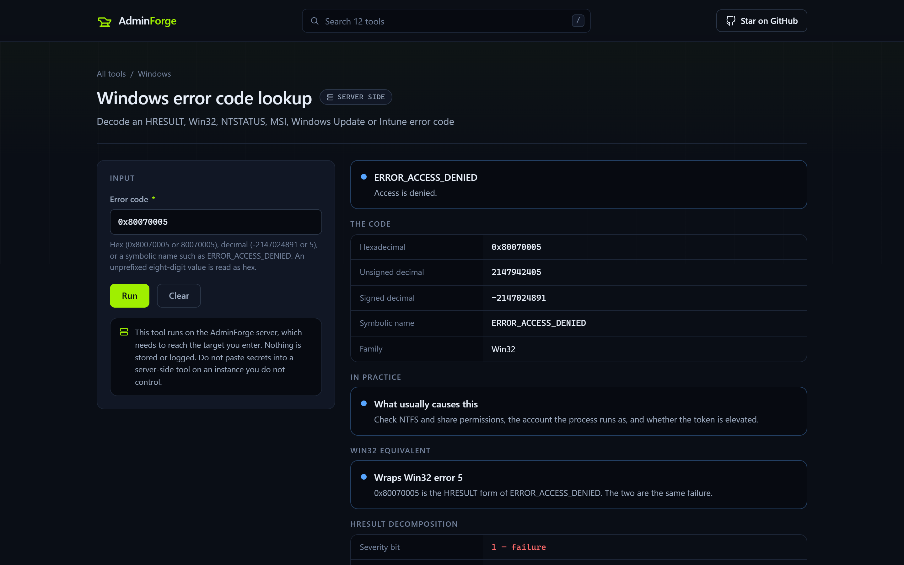

<div align="center">

# AdminForge

**A self-hosted toolbox of browser-based utilities for sysadmins, IT and security engineers.**

Subnets, certificates, DNS, mail records, Windows error codes and the rest of the daily
lookups — in one container you run yourself.

[](https://github.com/juandresrodca/AdminForge/actions/workflows/ci.yml)
[](https://dotnet.microsoft.com/)
[](LICENSE)
[](https://github.com/juandresrodca/AdminForge/pkgs/container/adminforge)
[](https://github.com/juandresrodca/AdminForge/issues?q=is%3Aissue+is%3Aopen+label%3A%22good+first+issue%22)
[](https://github.com/juandresrodca/AdminForge/issues?q=is%3Aissue+is%3Aopen+label%3Ahacktoberfest)



</div>

---

## Run it in 30 seconds

```bash
docker run -d --name adminforge -p 8080:8080 ghcr.io/juandresrodca/adminforge:latest
```

Then open <http://localhost:8080>. That is the whole installation: no database, no
accounts, no configuration file, no reverse proxy required to get started.

<details>
<summary>docker compose</summary>

```yaml
services:
  adminforge:
    image: ghcr.io/juandresrodca/adminforge:latest
    ports:
      - "8080:8080"
    restart: unless-stopped
    read_only: true
    tmpfs: [/tmp]
    environment:
      # Homelab? Turn this  on  to let the network tools reach your LAN.
      # Leave it off for anything reachable  from the internet.
      AdminForge__AllowPrivateTargets: "false"
```

</details>

<details>
<summary>From source</summary>

Needs the [.NET 10 SDK](https://dotnet.microsoft.com/download) and nothing else.

```bash
git clone https://github.com/juandresrodca/AdminForge.git
cd AdminForge
dotnet run --project src/AdminForge.Web
```

</details>

---

## Why this exists

There are good browser toolboxes already — and they are all aimed at web developers.
Ask one of them how many days are left on a certificate, whether a domain's SPF record
is about to blow the ten-lookup limit, or what `0x80070005` means, and you are back to
five open tabs.

AdminForge is the same idea pointed at **infrastructure work**:

- **Self-hosted, in one container.** Your queries stay on your network. The certificate
  you are checking, the domain you are auditing, the token you are decoding — none of it
  goes to somebody else's server.
- **Honest about where your data goes.** Every tool is labelled `In browser` or
  `Server side`, and anything that could touch a secret is built to run in the browser
  and never make a request at all.
- **No third-party requests, ever.** No CDN, no analytics, no telemetry, no web fonts.
  It works in an air-gapped network.
- **Tilted at sysadmins and security**, not at front-end work. That is the whole point.

---

## What is in it

Twelve tools today, across six categories.

### Network

| Tool | Runs | What it does |
|---|---|---|
| **Subnet calculator** | Server | Network, broadcast, usable range, mask, wildcard and host count for IPv4 and IPv6 — plus splitting a block into equal subnets |
| **DNS lookup** | Server | A, AAAA, MX, TXT, NS, CNAME, SOA, CAA, SRV and PTR against the system resolver or one you choose |
| **RDAP and WHOIS lookup** | Server | Who registered a domain or owns an IP range, with registration and expiry dates |

### Security

| Tool | Runs | What it does |
|---|---|---|
| **TLS certificate checker** | Server | Real handshake: expiry, chain, SANs, issuer, key strength, signature algorithm and negotiated protocol |
| **HTTP security headers** | Server | Weighted grade across CSP, HSTS, X-Frame-Options and the rest, plus the headers that advertise your stack |
| **JWT decoder** | Browser | Header, claims and expiry, interpreted — and the token never leaves your machine |
| **Password generator** | Browser | Passwords and passphrases from `crypto.getRandomValues`, with the real entropy |
| **Hash generator** | Browser | MD5, SHA-1, SHA-256, SHA-384, SHA-512, and checksum verification |

### Windows

| Tool | Runs | What it does |
|---|---|---|
| **Windows error code lookup** | Server | HRESULT, Win32, NTSTATUS, MSI, Windows Update, DISM and Intune codes — with the HRESULT decomposition even for codes not in the dataset |

### Email

| Tool | Runs | What it does |
|---|---|---|
| **SPF, DKIM and DMARC checker** | Server | Whether a domain's mail authentication would actually stop a spoofed message, including the SPF ten-lookup limit |

### Encoding and Ops

| Tool | Runs | What it does |
|---|---|---|
| **Encoder and decoder** | Browser | Base64, base64url, percent-encoding, hex and HTML entities, UTF-8 correct |
| **Cron expression parser** | Server | Field-by-field explanation and the next runs in the time zone you pick |

<div align="center">


</div>

---

## Add a tool in 15 minutes

This is the part the architecture is built around. **Adding a tool touches nothing
else** — no registration, no route, no core file, no CSS.

```powershell
./tools/new-tool.ps1 -Name "MAC address lookup" -Category Network
```

That writes three files in one new folder, and the tool already appears in the gallery
and already passes CI. Then you describe the inputs:

```csharp
[ToolField("MAC address", Placeholder = "00:1A:2B:3C:4D:5E", Required = true, MaxLength = 64)]
public string Address { get; set; } = string.Empty;
```

…and return structured blocks:

```csharp
return ToolResult.Build()
    .Status(ResultStatus.Ok, vendor.Name, $"OUI {mac.Oui}")
    .KeyValues("Address", kv => kv
        .Add("Normalised", mac.ToString(), monospace: true)
        .Add("Locally administered", mac.IsLocal ? "yes" : "no"))
    .ToResult();
```

You never write HTML. The form is generated from the attributes, the results are
rendered by the core, and your tool looks exactly like every other one.

**→ [CONTRIBUTING.md](CONTRIBUTING.md)** has the full walkthrough.
**→ [ARCHITECTURE.md](ARCHITECTURE.md)** explains how the registry, the form generator
and the SSRF guard fit together.

### Good first issues

Around thirty tools are specified and waiting, each with acceptance criteria. Comment
on one and it is yours.

**[→ Browse the `good first issue` list](https://github.com/juandresrodca/AdminForge/issues?q=is%3Aissue+is%3Aopen+label%3A%22good+first+issue%22)**

<details>
<summary>The roadmap, at a glance</summary>

**Network** — MAC/OUI vendor lookup · IP geolocation and ASN · TCP port reachability ·
reverse DNS bulk lookup · subnet splitter and VLSM planner · Wake-on-LAN packet builder ·
URL redirect chain tracer

**Security** — X.509 certificate decoder · CSR decoder · hash identifier · HMAC generator
and verifier · bcrypt generator and verifier · pwned password checker (k-anonymity) ·
security.txt validator

**Windows and identity** — Windows security event ID lookup · PowerShell
`-EncodedCommand` decoder · Active Directory `userAccountControl` decoder · well-known
SID resolver · LDAP filter builder

**Email** — email header analyser · DMARC record builder

**Ops** — uptime and SLA calculator · RAID capacity calculator · storage and data-rate
converter · chmod calculator

Plus the easy on-ramps deliberately left unbuilt: GUID generator, timestamp converter,
JSON formatter, regex tester.

</details>

---

## Configuration

Set through `appsettings.json` or `AdminForge__*` environment variables.

| Setting | Default | What it does |
|---|---|---|
| `AllowPrivateTargets` | `false` | Lets server-side tools reach private, loopback and link-local addresses. **Homelab only** — an internet-facing instance with this on is an open proxy into your network. |
| `ToolTimeoutSeconds` | `15` | Budget for a single tool run. |
| `MaxResponseBytes` | `2097152` | Ceiling on any fetched response body. |
| `MaxRedirects` | `5` | Redirects followed, each re-validated. |
| `BlockedHosts` | `[]` | Extra hosts to refuse. |
| `InstanceBanner` | — | Notice shown on every page, e.g. to mark a public demo. |
| `RateLimit__PermitLimit` | `30` | Tool runs allowed per client, per window. |
| `RateLimit__WindowSeconds` | `60` | Length of that window. |

Invalid values fail at startup rather than at the first request.

---

## Security

AdminForge holds no accounts and no data, so the interesting surface is narrow — but
half of its tools fetch a target you supply, which is server-side request forgery by
design. That is handled once, in the core, and every tool inherits it:

- Private, loopback, link-local (including cloud metadata at `169.254.169.254`),
  carrier-grade NAT and unique-local addresses are refused unless the operator opts in
- A name resolving to a mix of public and private addresses is refused outright — that
  is a DNS-rebinding vector
- Every redirect hop is re-validated, and the socket refuses a private address even if
  DNS changes mid-flight
- A strict content security policy with no inline script or style and no third-party
  origins, and a per-client rate limiter on tool execution

Full detail in [ARCHITECTURE.md](ARCHITECTURE.md#security). To report a vulnerability,
see [SECURITY.md](SECURITY.md).

---

## Built with

.NET 10 · ASP.NET Core MVC · [DnsClient.NET](https://github.com/MichaCo/DnsClient.NET) ·
[Cronos](https://github.com/HangfireIO/Cronos). No front-end framework, no bundler, no
`node_modules` — the browser modules are plain ES modules using platform APIs.

## Contributors

<!-- ALL-CONTRIBUTORS-LIST:START - Do not remove or modify this section -->
<!-- prettier-ignore-start -->
<!-- markdownlint-disable -->
<!-- markdownlint-restore -->
<!-- prettier-ignore-end -->
<!-- ALL-CONTRIBUTORS-LIST:END -->

Every contributor gets credited here, whatever the contribution —
[all-contributors](https://allcontributors.org) counts documentation, bug reports,
design and ideas alongside code.

## Licence

[MIT](LICENSE) © Juan Andres Rodriguez

---

<div align="center">

**If AdminForge saves you a tab, a terminal or an argument with a certificate — ⭐ star it.**

That is genuinely how a project like this finds the people who would contribute to it.

</div>
